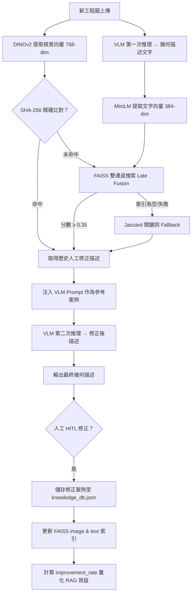

# VLM Tool — 工業製程圖紙辨識工具

> **國立高雄科技大學 AIIAStudents**
> 基於 VLM + Multi-Model RAG 的工業製程圖紙幾何描述系統

---

## 系統簡介

VLM Tool 是專為工業製程圖紙設計的 AI 輔助辨識工具。系統使用本地端 Vision Language Model（VLM）對板金零件的 2D 工程圖紙進行幾何描述，並透過 RAG（Retrieval-Augmented Generation）結合人工修正的歷史案例，持續提升描述品質。

**核心設計原則：**
- VLM 強制輸出**英文**結構化描述（避免小型模型中文詞彙不足的問題）
- VLM 只負責**幾何描述**，不預測製程（製程推理由下游 LLM 負責）
- RAG 採用**雙通道語意檢索**（圖片 embedding + 文字 embedding）提升案例召回率
- Human-in-the-Loop（HITL）修正後的描述會累積到知識庫，系統越用越準

---

## 系統架構

```
工程圖紙 (JPG / PNG / PDF)
    |
    v
[SymbolMatcher] --- CV 模板比對（VLM 前執行）
    |                 -> 注入 [CV-CONFIRMED] 錨點
    v
[VLM] --- Gemma 3 4B via LM Studio（第 1 次呼叫）
    |       -> 輸出三段式幾何描述
    v
[RAG 檢索] --- FAISS 雙索引
    |   圖片通道: DINOv2 ViT-Base（768-dim，權重 0.4）
    |   文字通道: multilingual-MiniLM-L12-v2（384-dim，權重 0.6）
    |   快速路徑: SHA-256 精確比對 > Jaccard 關鍵字 fallback
    v
[VLM] --- （第 2 次呼叫，注入參考案例）
    |       -> 自我修正後的描述
    v
[輸出] --- raw_vlm_description（英文結構化文字）
    |
    v
[HITL] --- 使用者修正描述 -> 存入知識庫
             -> Embedding 同步更新至 FAISS 索引
```

---

## 快速開始

### 環境需求

- Python 3.10+
- [LM Studio](https://lmstudio.ai/)，並載入視覺模型（例如 `google/gemma-3-4b-it`）

### 安裝

```bash
pip install -r requirements.txt
```

首次執行時 `sentence-transformers` 模型會自動下載（約 500MB，下載後快取）。

PaddleOCR 為可選功能（僅用於父圖 / BOM OCR 掃描）：

```bash
# Windows
pip install paddlepaddle==2.6.1 -f https://www.paddlepaddle.org.cn/whl/windows/mkl/avx/stable.html
```

### 啟動

```bash
streamlit run aov_app.py
```

開啟瀏覽器至 http://localhost:8501

### LM Studio 設定

1. 下載安裝 [LM Studio](https://lmstudio.ai/)
2. 載入視覺模型（建議 `google/gemma-3-4b-it`）
3. 啟動本地伺服器（預設 `http://localhost:1234`）
4. 系統會透過 OpenAI-compatible API 自動連線

---

## 使用流程

1. **上傳**子圖（必填）+ 可選的父圖 + BOM 圖片
2. **多視角**上傳：支援 Top / Front / Side / Isometric 視角
3. **設定** VLM 與 RAG 參數（側邊欄）
4. **執行**分析
5. **查看**右側 VLM 幾何描述
6. **修正**描述（HITL 文字編輯器）
7. **儲存**修正後的描述至 RAG 知識庫

---

## 專案結構

```
vlm_tool/
|-- aov_app.py                              # Streamlit UI 主入口
|-- main.py                                 # 啟動腳本
|-- requirements.txt
|
|-- app/
|   |-- config.py                           # 全域設定
|   |
|   |-- core/                               # API 外觀層
|   |   |-- contracts.py                    #   AnalysisRequest dataclass
|   |   +-- service.py                      #   AOVCoreService（主要入口）
|   |
|   |-- manufacturing/                      # VLM Pipeline 核心
|   |   |-- schema.py                       #   資料合約（ExtractedFeatures, RecognitionResult）
|   |   |-- pipeline.py                     #   主流程協調（VLM-only）
|   |   |-- prompts.py                      #   VLM Prompt 模板與詞彙控制
|   |   |-- extractors/
|   |   |   |-- vlm_client.py               #   LM Studio / OpenAI-compatible VLM Client
|   |   |   |-- parent_parser.py            #   父圖全域資訊解析器
|   |   |   |-- embeddings.py               #   DINOv2 視覺 Embedding
|   |   |   |-- pdf_extractor.py            #   PDF 轉高解析度圖片
|   |   |   +-- ocr.py                      #   PaddleOCR 封裝（可選）
|   |   +-- decision/
|   |       +-- rule_router.py              #   BOM 文字 -> CV 技能觸發（正則規則）
|   |
|   |-- knowledge/                          # RAG 知識庫
|   |   |-- manager.py                      #   KnowledgeBaseManager（CRUD + 語意檢索）
|   |   +-- vector_store.py                 #   FAISS 雙索引 + TextEmbedder
|   |
|   |-- vision/
|   |   +-- symbol_matcher.py               #   多尺度 CV 模板比對
|   |
|   +-- features/                           # 功能動作層
|       |-- analysis_actions.py             #   執行分析、儲存 RAG 案例
|       |-- upload_flow.py                  #   圖片解碼（框架無關）
|       |-- knowledge_admin.py              #   知識庫 CRUD
|       +-- symbol_library.py               #   符號模板管理
|
+-- components/                             # Streamlit UI 元件
    |-- style.py                            #   CSS 樣式
    |-- sidebar.py                          #   側邊欄
    |-- sidebar_panel.py                    #   側邊欄子面板
    |-- results_panel.py                    #   結果顯示 & HITL 渲染
    +-- text_format.py                      #   信心度標籤格式化
```

---

## 模組化移植指南

以下各模組可獨立抽取使用，依據需求挑選即可。

### 1. VLM Client — 視覺語言模型呼叫

> **檔案**：`app/manufacturing/extractors/vlm_client.py`
> **用途**：對任何圖片發送 prompt 給 LM Studio / OpenAI-compatible VLM，取得文字回應
> **pip 依賴**：`openai>=1.0.0`, `opencv-python`, `numpy`
> **內部依賴**：`app/config.py`（僅讀 `VLM_BASE_URL`，可直接改寫）

```python
from app.manufacturing.extractors.vlm_client import VLMClient

client = VLMClient(base_url="http://localhost:1234/v1")
if client.is_available():
    result = client.analyze_image(
        image_path="drawing.jpg",
        prompt="描述這張圖片的內容",
        temperature=0.1,
        max_tokens=512,
    )
    print(result)
```

**移植方式**：複製 `vlm_client.py`，將 `from app.config import ...` 改為直接寫死或讀環境變數。

---

### 2. Visual Embedder — DINOv2 圖片向量化

> **檔案**：`app/manufacturing/extractors/embeddings.py`
> **用途**：將圖片轉為 768 維向量（DINOv2 ViT-Base），適用於圖片相似度比對
> **pip 依賴**：`torch`, `timm`, `Pillow`, `opencv-python`, `numpy`
> **內部依賴**：無

```python
from app.manufacturing.extractors.embeddings import VisualEmbedder

embedder = VisualEmbedder(model_type="dinov2")
vec = embedder.extract_from_file("drawing.jpg")  # shape: (768,)
```

**移植方式**：直接複製 `embeddings.py`，零修改可用。

---

### 3. RAG 知識庫 — FAISS 雙通道檢索 + HITL 儲存

> **檔案**：`app/knowledge/manager.py` + `app/knowledge/vector_store.py`
> **用途**：儲存人工修正案例，雙通道（圖片 + 文字）語意檢索最相似案例
> **pip 依賴**：`faiss-cpu>=1.7.4`, `sentence-transformers>=3.0.0`, `numpy`
> **內部依賴**：`embeddings.py`（圖片向量化）

```python
from app.knowledge.manager import KnowledgeBaseManager

kb = KnowledgeBaseManager(db_path="my_kb.json", image_storage_dir="my_images")

# 新增案例
kb.add_entry(
    image_path="drawing.jpg",
    features={"raw_vlm_description": "corrected description here"},
    correct_processes=[],
    reasoning="人工修正備註",
    bom_context="SUS304, T1.5",
)

# 檢索相似案例
results = kb.retrieve_similar(
    vlm_feats=None,
    image_path="new_drawing.jpg",
    raw_vlm_text="VLM first-pass output",
    top_k=3,
)
```

**向量索引細節**（`vector_store.py`）：

| 通道 | 模型 | 維度 | 權重 |
|------|------|------|------|
| 圖片 | DINOv2 ViT-Base | 768 | 0.4 |
| 文字 | `paraphrase-multilingual-MiniLM-L12-v2` | 384 | 0.6 |

**移植方式**：複製 `knowledge/` 資料夾 + `embeddings.py`，共 3 個檔案。

---

### 4. Symbol Matcher — CV 模板比對

> **檔案**：`app/vision/symbol_matcher.py`
> **用途**：多尺度模板比對，偵測工程圖紙上的焊接符號、表面處理標記等
> **pip 依賴**：`opencv-python`, `numpy`
> **內部依賴**：無

```python
from app.vision.symbol_matcher import SymbolMatcher

matcher = SymbolMatcher(library_dir="data/symbol_library", threshold=0.70)
hits = matcher.match_symbols(target_img)
# [{"name": "weld_v", "confidence": 0.85, "location": (x, y, w, h)}, ...]
```

**特性**：多尺度掃描（0.2x–1.0x）、支援 alpha 遮罩 PNG、NCC 評分

**移植方式**：直接複製 `symbol_matcher.py` + 模板圖片資料夾，零修改可用。

---

### 5. PDF Extractor — PDF 轉高解析度圖片

> **檔案**：`app/manufacturing/extractors/pdf_extractor.py`
> **用途**：將 PDF 頁面轉為高 DPI 的 numpy array，支援全頁或區域擷取
> **pip 依賴**：`PyMuPDF>=1.26.0`, `Pillow`, `opencv-python`, `numpy`
> **內部依賴**：無

```python
from app.manufacturing.extractors.pdf_extractor import PDFImageExtractor

extractor = PDFImageExtractor(target_dpi=300)
img = extractor.extract_full_page("drawing.pdf", page_num=0)  # np.ndarray (BGR)
```

**移植方式**：直接複製 `pdf_extractor.py`，零修改可用。

---

### 6. OCR Extractor — PaddleOCR 中英文辨識

> **檔案**：`app/manufacturing/extractors/ocr.py`
> **用途**：對圖片進行 OCR 文字辨識，支援中英日韓多語系
> **pip 依賴**：`paddleocr>=3.4.0`, `paddlepaddle>=2.6.2`, `opencv-python`, `numpy`
> **內部依賴**：`app/manufacturing/schema.py`（僅用 `OCRResult` dataclass，可自行定義替代）

```python
from app.manufacturing.extractors.ocr import OCRExtractor

ocr = OCRExtractor(lang="ch")
results = ocr.extract(image, confidence_threshold=0.6)
# [OCRResult(text="SUS304", confidence=0.95, bbox=[...]), ...]
```

**移植方式**：複製 `ocr.py`，將 `OCRResult` import 改為自定義 dataclass 或直接用 dict。

---

### 7. Parent Image Parser — 父圖 BOM 資訊解析

> **檔案**：`app/manufacturing/extractors/parent_parser.py`
> **用途**：解析父圖（組立圖）中的材質、板厚、客戶、表面處理等 BOM 資訊
> **pip 依賴**：`openai>=1.0.0`, `opencv-python`, `numpy`
> **內部依賴**：`vlm_client.py`（VLM 呼叫）、`ocr.py`（可選）

```python
from app.manufacturing.extractors.parent_parser import ParentImageParser

parser = ParentImageParser(vlm_client=my_vlm_client)
ctx = parser.parse(parent_image)
# ctx.material = "SUS304", ctx.thickness = "T1.5", ctx.customer = "ASML"
```

**內建關鍵字規則**：材質（白鐵/鋁板/鐵板）、客戶（ASML/日本）、潔淨室等級、表面處理

**移植方式**：複製 `parent_parser.py` + `vlm_client.py`。

---

### 8. Rule Router — BOM 文字觸發 CV 技能

> **檔案**：`app/manufacturing/decision/rule_router.py`
> **用途**：根據 BOM 文字內容（焊接、攻牙、折彎等關鍵字）決定需啟動哪些 CV 掃描技能
> **pip 依賴**：無（純 Python `re`）
> **內部依賴**：無

```python
from app.manufacturing.decision.rule_router import plan_vision_skills, describe_skills

skills = plan_vision_skills("材質: SUS304, 製程: 焊接, 攻牙M6")
# ['scan_weld_symbols', 'scan_thread_marks']

print(describe_skills(skills))
# "焊接符號掃描、螺紋標記掃描"
```

**移植方式**：直接複製 `rule_router.py`，零依賴。

---

### 9. Prompt Builder — VLM Prompt 模板生成

> **檔案**：`app/manufacturing/prompts.py`
> **用途**：組裝 VLM prompt，包含 BOM 事實、RAG 參考案例、CV 錨點、anti-hallucination 規則
> **pip 依賴**：無（純字串組裝）
> **內部依賴**：無

```python
from app.manufacturing.prompts import get_vlm_descriptive_prompt

prompt = get_vlm_descriptive_prompt(
    bom_context="SUS304, T1.5, 耐震支架",
    rag_context="[參考案例描述]",
    system_anchors=["[CV-CONFIRMED] weld_v_groove detected"],
)
```

**移植方式**：直接複製 `prompts.py`，零依賴。

---

### 10. Schema — 資料合約與詞彙表

> **檔案**：`app/manufacturing/schema.py`
> **用途**：定義所有資料結構（`ExtractedFeatures`, `RecognitionResult`, `OCRResult` 等）與 Tier-1 標準詞彙表
> **pip 依賴**：`numpy`
> **內部依賴**：無

**主要 dataclass**：

| Class | 用途 |
|-------|------|
| `ExtractedFeatures` | VLM 輸出 + 嵌入向量 + 符號偵測結果 |
| `RecognitionResult` | 最終分析結果（features + 時間 + 警告 + RAG 參考） |
| `OCRResult` | OCR 辨識結果（文字 + 信心度 + bbox） |
| `SymbolDetection` | 符號偵測結果 |
| `TIER1_VOCABULARY` | 35 個板金標準英文術語 |

**移植方式**：直接複製 `schema.py`，零依賴。

---

### 模組依賴關係圖

```
[schema] [prompts] [rule_router]        ← 零依賴，可獨立使用
    |        |          |
    v        v          v
[vlm_client] [embeddings] [ocr] [pdf_extractor] [symbol_matcher]  ← 單一功能模組
    |             |         |
    v             v         v
[parent_parser]  [vector_store]         ← 組合模組
                      |
                      v
                 [kb_manager]           ← RAG 完整功能
                      |
                      v
                  [pipeline]            ← 主流程（組裝以上全部）
                      |
                      v
                [core/service]          ← 對外 Facade
```

---

## Multi-Modal RAG 架構詳解

本專案的核心競爭力在於其針對工業圖紙開發的 **Multi-Modal Retrieval-Augmented Generation（多模態檢索增強生成）** 系統。該系統允許 VLM 在分析新圖面時，自動檢索並參考「過去專家修正過」的相似案例，從而大幅提升辨識精準度並降低幻覺（Hallucination）。

---

### 1. 視覺特徵提取：DINOv2（自監督學習）

系統採用 **Meta AI** 發表的 **DINOv2** 作為視覺特徵提取器，規格為 `ViT-Base / patch14`，輸出特徵維度 **768-dim**。

**DINOv2 是什麼？**

DINOv2 屬於**自監督學習（Self-Supervised Learning, SSL）**模型，使用 DINO（Self-DIstillation with NO Labels）框架訓練。其最大特點是**完全不需要人工標記資料**，模型透過對同一張圖的不同裁切版本互相蒸餾（Self-Distillation），自行學習視覺特徵，因此能捕捉到極細微的幾何結構與空間關係。

**為什麼選 DINOv2 而不選 CLIP？**

| 比較維度 | DINOv2 | CLIP |
|----------|--------|------|
| 訓練目標 | 幾何與結構特徵（SSL） | 圖文語意對齊 |
| 對線條、輪廓的敏感度 | 高 | 低 |
| 適合場景 | 工程圖、線稿、幾何圖形 | 自然語言描述的照片 |

工程圖紙是黑白線稿，核心資訊由幾何特徵（線條、圓弧、倒角、孔位、拓撲關係）組成，幾乎沒有 CLIP 所擅長的語意色彩。DINOv2 在此類場景的表現遠優於 CLIP。

---

### 2. 文字語意提取：Multilingual MiniLM

系統使用 **`paraphrase-multilingual-MiniLM-L12-v2`**（sentence-transformers 系列）對 VLM 輸出的幾何描述做語意向量化，輸出 **384-dim**。

- **MiniLM 知識蒸餾**：以大型語言模型為教師模型蒸餾而來，推理速度快、記憶體佔用小
- **多語言支援（50+ 語言）**：工業圖紙常涉及中英混雜術語（如 `SUS304 拋光處理`、`Chamfer 0.5`），此模型能跨語言對齊語意
- **L2 正規化**：向量寫入 FAISS 前強制正規化，確保相似度計算一致

---

### 3. 向量索引：FAISS IndexFlatIP

兩種向量分別存入**兩個獨立的 FAISS 索引**：

| 索引 | 存放向量 | 維度 |
|------|---------|------|
| `image.faiss` | DINOv2 視覺向量 | 768 |
| `text.faiss` | MiniLM 文字向量 | 384 |

> **為什麼要兩個獨立索引？**
> 視覺向量（768-dim）與文字向量（384-dim）維度不同，**無法直接拼接或存入同一個索引**。正確做法是各自獨立搜索後，在**分數層級（Score Level）**做加權融合，即標準的 **Late Fusion** 架構。

**相似度計算原理：**

FAISS 使用 `IndexFlatIP`（Inner Product，內積）。由於向量已 L2 正規化，單位向量的內積等於 Cosine Similarity：

$$\text{Score} = \vec{v_1} \cdot \vec{v_2} = |\vec{v_1}||\vec{v_2}|\cos(\theta) = \cos(\theta)$$

結果值域為 `[0, 1]`，精確搜索（非近似），適合中小型知識庫（< 10,000 筆）。

---

### 4. 雙通道加權融合（Late Fusion）

$$\text{Combined Score} = S_{image} \times 0.4 + S_{text} \times 0.6$$

**為什麼文字權重（0.6）高於圖片（0.4）？**

VLM 第一次輸出的幾何描述文字是**領域對齊的語意表達**，比圖片像素更穩定地反映幾何結構（例如「L-shaped Bracket with two flanges」這類描述比像素分佈更具判斷力）。文字向量補足了圖片向量在圖面排版差異上的不穩定性。

**相似度閾值：** `MIN_SIMILARITY = 0.35`，低於此值的結果直接丟棄，避免低品質匹配誤導 VLM 的第二次推理。

> ⚠️ **閾值調校提醒**：在高維度空間（768-dim）中，Cosine Similarity 可能出現「維度擠壓（Hubness Problem）」，導致不相干的向量分數也落在 0.5–0.7 之間。建議上線前收集 100 張工程圖，觀察相似與不相似圖的分數分佈，再調整最適合的切割點。

---

### 5. 三層 Fallback 鏈

```
┌─────────────────────────────────────────────┐
│  層 1：SHA-256 精確雜湊比對  (score = 1.0)  │  ← 最快，O(1)
│  相同圖片直接命中，略過所有向量計算          │
└──────────────────┬──────────────────────────┘
                   │ 未命中
                   ▼
┌─────────────────────────────────────────────┐
│  層 2：FAISS 雙通道語義搜索（Late Fusion）   │  ← 主力
│  image×0.4 + text×0.6，閾值 0.35           │
└──────────────────┬──────────────────────────┘
                   │ FAISS 不可用 / 索引為空
                   ▼
┌─────────────────────────────────────────────┐
│  層 3：Jaccard 關鍵詞 Fallback              │  ← 保底
│  4+ 字元詞彙的 Jaccard Index，純文字比對    │
└─────────────────────────────────────────────┘
```

每層都套用相同的閾值過濾（0.35），保證任何情況下都有確定性的輸出。

---

### 6. RAG 有效性量化

每次人工修正後，系統自動計算本次 RAG 的幫助程度：

| 指標 | 說明 |
|------|------|
| $v1\_distance$ | 第一次 VLM 輸出 vs 人工修正的 Cosine 距離 |
| $v2\_distance$ | RAG 後 VLM 輸出 vs 人工修正的 Cosine 距離 |
| $\text{Improvement Rate}$ | $(v1\_dist - v2\_dist)\ /\ v1\_dist$ — 大於 0 表示 RAG 有正面貢獻 |

---

### 7. 其他機制

- **條目去重**：以 SHA-256 辨識重複上傳，同一圖的新版本會將舊版標記為 `superseded` 並從 FAISS 移除，避免索引膨脹
- **Tier-1 詞彙錨（Vocab Anchors）**：Retrieval 結果附加 35 個預定義的板金標準術語注入 VLM Prompt，抑制幻覺輸出

---

### RAG 完整流程圖



---

### RAG 儲存位置

| 路徑 | 內容 |
|------|------|
| `knowledge_db.json` | 案例 metadata（id、SHA-256、描述、BOM 上下文） |
| `knowledge_images/` | 圖片副本 |
| `knowledge_vectors/image.faiss` | DINOv2 768-dim 視覺索引 |
| `knowledge_vectors/text.faiss` | MiniLM 384-dim 文字索引 |
| `knowledge_vectors/entry_ids.npy` | 索引 ID 對照表 |

以上皆在 `.gitignore`，屬本地運行資料，不納入版控。

---

## 參數設定

### VLM

| 參數 | 預設值 |
|------|--------|
| VLM 端點 | `http://localhost:1234/v1` |
| Temperature（第 1 次呼叫） | 0.1 |
| Temperature（RAG 第 2 次呼叫） | 0.15 |
| Max tokens | 512 |
| 模型 | 自動偵測 LM Studio 已載入模型 |

### RAG

| 參數 | 預設值 |
|------|--------|
| 圖片 Embedding 權重 | 0.4 |
| 文字 Embedding 權重 | 0.6 |
| 圖片 Embedding 模型 | DINOv2 ViT-Base（768-dim） |
| 文字 Embedding 模型 | `paraphrase-multilingual-MiniLM-L12-v2`（384-dim） |
| Top-K 檢索數量 | 3 |

---

## 開發團隊

**實驗室**：國立高雄科技大學 AIIAStudents（NKUST AIIAStudents）
**專案**：VLM Tool — 工業製程圖紙辨識工具
